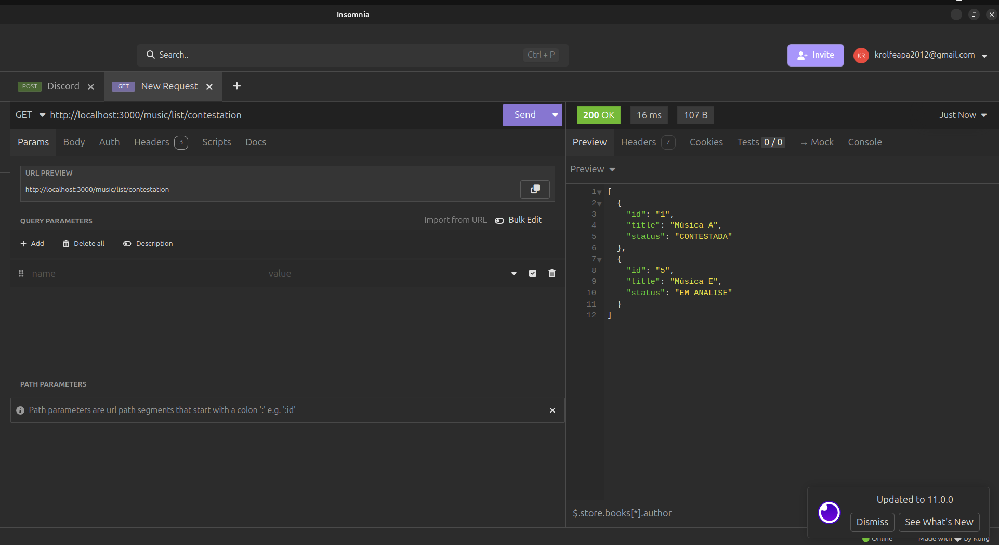
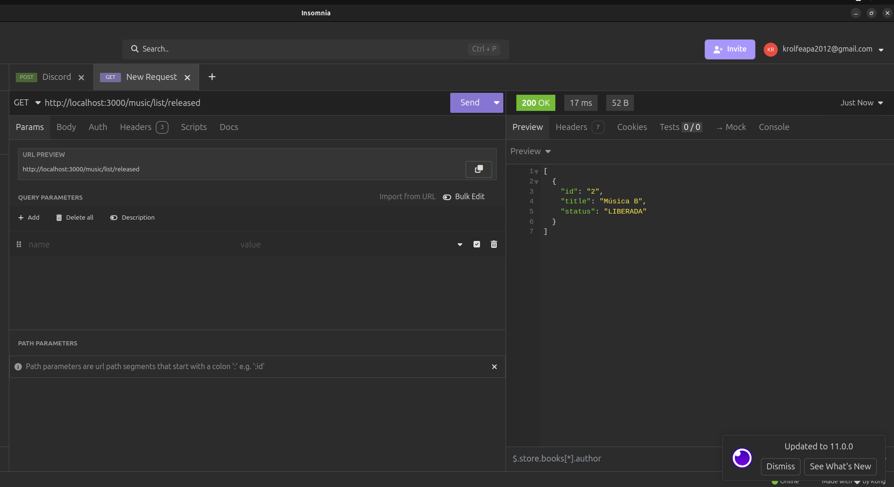

# 🎵 POC - Strategy Pattern para Listagem de Músicas (NestJS)

Esta POC demonstra a aplicação do **Design Pattern Strategy** em uma API de gerenciamento de músicas com **NestJS**, permitindo diferentes filtros de listagem com regras de negócio independentes.

---

## ✅ Objetivo

Permitir que a API retorne diferentes "listas de músicas" baseadas em **regras de negócio específicas**, usando um único endpoint dinâmico com estratégias independentes para cada tipo de listagem.

---

## 🚀 Tecnologias Utilizadas

- **NestJS**
- **TypeScript**
- **Strategy Pattern**
- Repositório fake (array em memória)

---

## 📁 Estrutura do Projeto

```
src/
├── app.module.ts
└── music/
    ├── controller/
    │   └── music.controller.ts
    ├── dto/
    │   └── music.dto.ts
    ├── entities/
    │   └── music.entity.ts
    ├── repository/
    │   └── music.repository.ts
    ├── service/
    │   └── music-list.service.ts
    └── strategy/
        ├── music-list.strategy.ts
        ├── contestation.strategy.ts
        ├── released.strategy.ts
        └── pending.strategy.ts
```

---

## 🛠️ Como Rodar Localmente

1. Clone o repositório:

```bash
git clone <url-do-repo>
cd music-strategy-poc
```

2. Instale as dependências:

```bash
npm install
```

3. Inicie o servidor:

```bash
npm run start:dev
```

Acesse: `http://localhost:3000`

---

## 🌐 Endpoint Único

```http
GET /music/list/:type
```

### Tipos disponíveis:

| Tipo (`:type`)   | Regras de Negócio                                        |
|------------------|-----------------------------------------------------------|
| `contestation`   | Músicas com status `CONTESTADA` ou `EM_ANALISE`          |
| `released`       | Músicas com status `LIBERADA`                            |
| `pending`        | Músicas com status `PENDENTE` ou `SEM_CONTRATO`          |

### Exemplos de uso:

```bash
GET /music/list/contestation
GET /music/list/released
GET /music/list/pending
```

---

## 🧪 Prints dos Testes

### 🔹 Lista: `pending`
Retorna músicas com status `PENDENTE` ou `SEM_CONTRATO`


---

### 🔹 Lista: `contestation`
Retorna músicas com status `CONTESTADA` ou `EM_ANALISE`



---

### 🔹 Lista: `released`
Retorna músicas com status `LIBERADA`



---

## ✅ Conclusão

- O uso do **Strategy Pattern** facilita a separação de regras de negócio específicas.
- O código é modular, limpo e altamente escalável.
- Novas listas podem ser adicionadas facilmente sem afetar as existentes.

---
